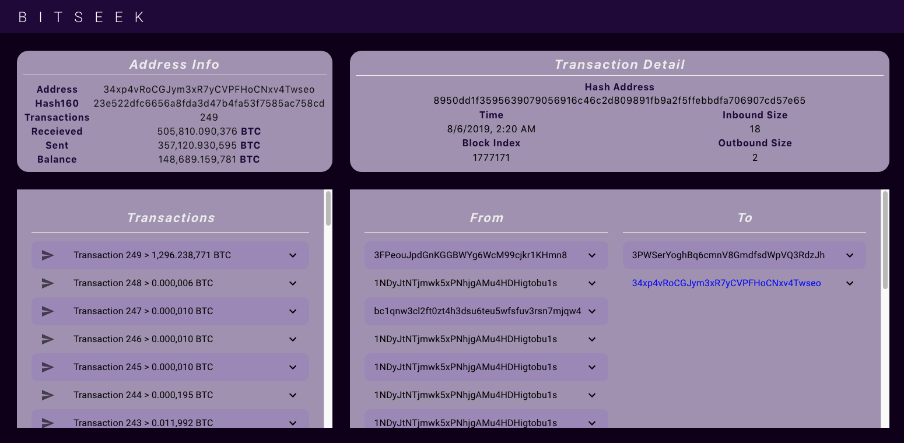

# BitSeek
[BitSeek](https://getstart3d.herokuapp.com/ "BitSeek") (live) is a single page app that searches for cryptocurrency details and transactions of bitcoin addresses using [Blockchain's APIs](https://www.blockchain.com/api/ "Blockchain API").

## Table of contents
* [Installation](#installation)
* [Features](#features)
* [Technologies](#technologies)
* [Landing Page](#landing-page)
* [Main Page](#main-page)
* [Additional Features](#additional-features)

## Installation
  * Clone this repo
  * `npm install` to install all dependencies
  * `npm start` to start react app server

## Features
  * A landing page to look up a bitcoin address (supports base58 or hash160 addresses)
    * An error message will appear if an invalid bitcoin address is entered
  * 4 main data/info sections once a valid address is entered
    * Address Info displaying transactions sent, received, and the current balance in BTC
    * Transactions displaying all transactions (and dates) with the ability to view up to the first transaction
    * Details of a specific transaction once selected from the list of all transactions - hash address, time, inbound size, outbound size, and block index
    * All of the inbounds and outbounds of a specific transaction - amounts sent and received from all addresses invovled
  * Seek info on another bitcoin address by clicking BitSeek at the top

## Technologies
  * Create React App
    * React hooks (useState, useEffect)
  * Redux
    * Redux hooks (useSelector, useDispatch)
  * Material UI
  * HTML/CSS3
  * [Blockchain API](https://www.blockchain.com/api/ "Blockchain API")

## Landing Page

## Main Page

## Additional Features

All transactions are shown, via dropdowns that provide additional information such as date of the transaction and the specific transaction amounts from all addresses invovled

ALl transactions can be loaded, up to the the first transaction made by the address